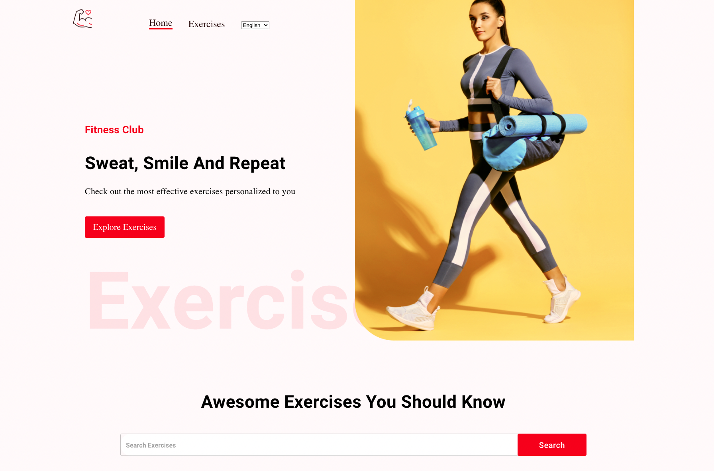
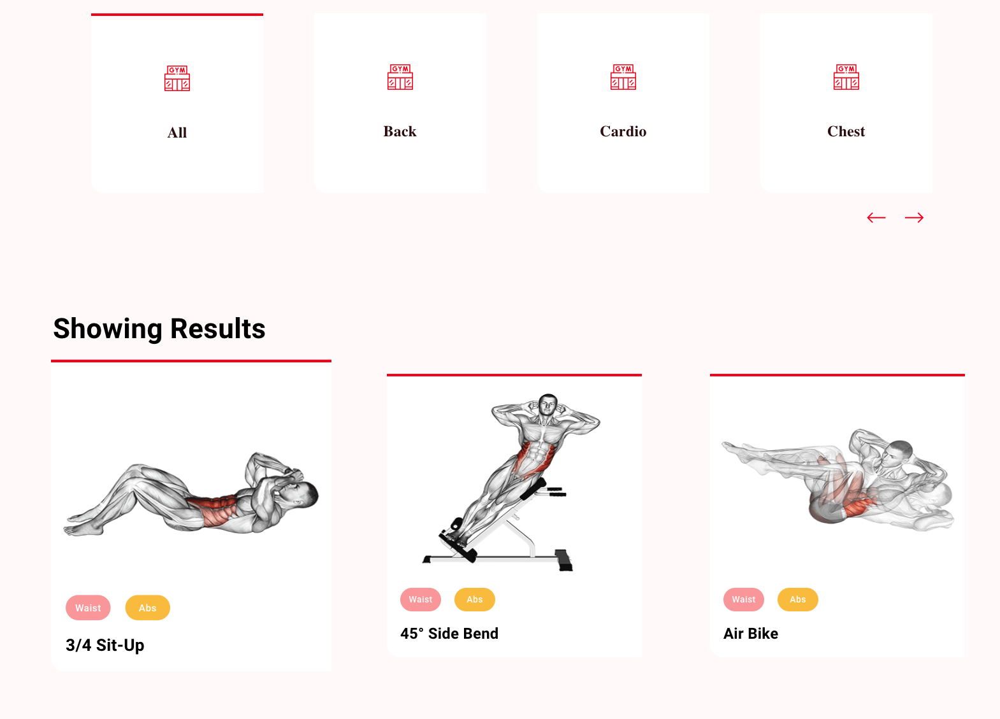
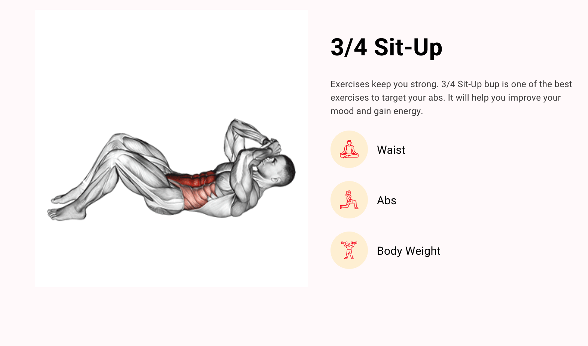
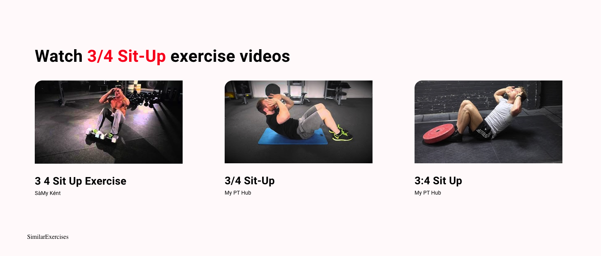

# The Fitness 💪🏋️‍♀️

# This is a Fitness App that was built using Rapid API and is a PWA web app. It shows different exercises for gym freak as well as videos of each and every exercise with full details of the exercises with great explanation. 🔥 🔥

### For clone this repository in your pc paste below link in your terminal 👇

```
git clone https://github.com/Milan-960/Fitness-app.git
```

```
npm install
```

```
npm start
```

```@github/clipboard-copy-element
REACT_APP_RAPID_API_KEY = "YOUR RapidAPI KEY"
ESLINT_NO_DEV_ERRORS = true
```

# Tech which I have Used


<h1>Home Page</h1>

<p>&nbsp;</p>

<h1>exercises Page</h1>

<p>&nbsp;</p>

<h1>details Page</h1>

<p>&nbsp;</p>

<h1>videos Page</h1>

<p>&nbsp;</p>

## Live App

- **[Watch Live Demo 🔥](https://milan-fitness-app.vercel.app/)**

## Author 😎

- **[Milan Sachani](https://github.com/milan-960)**
